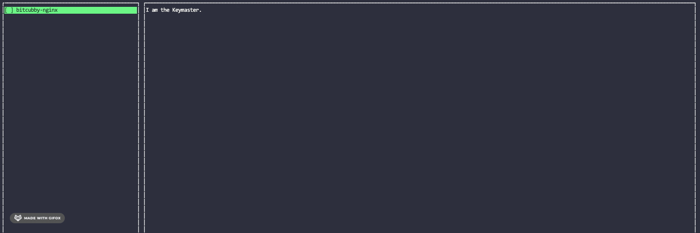

# Keymaster


> "I am the Keymaster! The Destructor is coming. Gozer the Traveler, the Destroyer."

## Show, Don't Tell



## What is it?

Keymaster is a terminal utility for managing SSH tunnels. It runs in the foreground and presents you with an interface with which you can interactively enable or disable SSH tunnels at will. If and when network errors occur, connections are automatically restored.

[Secure Pipes](https://www.opoet.com/pyro/index.php) is an excellent, GUI-based tool that provides similar functionality for users of MacOS (such as myself). While I am a fan of this tool, I wanted something CLI-based that would provide a consistent experience for users of MacOS, Linux, and Windows. I also wanted a tool that did not require extra tunnel configuration apart from what is already in the user's `~/.ssh/config` file. Necessity is the mother of invention, so here we are.

Connections are made with the SSH binary that exists on the user's machine. The path to this binary is configurable in a `~/keymaster.conf.json` file (shown below):

```
{
  "ssh": {
    // The default value for Macos: /usr/bin/ssh
    // The default value for Windows: C:\Program Files\Git\usr\bin\ssh.exe
    "path": "/usr/bin/ssh"
  },
  "hook": {
    // The (optional) path to a Node module to be run before each connection attempt. Useful if you need
    // to periodically sign a key via [Vault](https://www.vaultproject.io/) (often seen in Enterprisey environments) or perform some other action.
    "preconnect": "~/keymaster.js
  }
}
```

Keymaster reads the SSH config file stored at `~/.ssh/config` (shown below). It will only display entries with one or more `LocalForward` parameters attached to them.

```
# When this host is selected, port 5000 on the client will be forwarded to port 5000
# on pluto via a direct SSH connection to pluto (192.168.1.10).
Host pluto
    HostName 192.168.1.10
    Port 22
    User ubuntu
    IdentityFile ~/.ssh/id_rsa
    LocalForward 5000 127.0.0.1:5000

# This host will not be presented by the UI, as no LocalForward parameters have been set.
Host mars
    HostName 192.168.1.11
    User admin
    IdentityFile ~/.ssh/flurp

# When this host is selected, port 4000 on the client will be forwarded to port 4000
# on jupiter via an SSH connection that is proxied through mars.
Host jupiter
    HostName 192.168.1.12
    User system
    IdentityFile ~/.ssh/flurp
    ProxyJump mars
    LocalForward 4000 127.0.0.1:4000
```

## What Remains to be Done

It would be nice of this utility didn't require that a local SSH binary exist on the user's machine. Efforts were made to facilitate this via the [ssh2](https://github.com/mscdex/ssh2) library, but it doesn't seem to [play well with SSH certificates](https://github.com/mscdex/ssh2/pull/808), which would make this tool a lot less useful for a lot of people. Hopefully this can be revisited at some point.

## Get Started

```
npm install -g @tkambler/keymaster
keymaster
```
